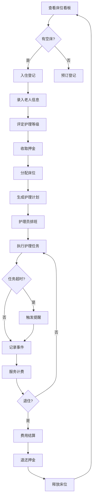

## 1. 产品概述

养老机构床位与护理排班管理系统，面向护理院前台和护理主管，提供床位管理、入住登记、护理计划、人员排班、事件记录和费用核对的一体化解决方案。通过数字化手段提升养老机构的运营效率，降低管理成本，确保护理服务质量。

## 2. 核心功能

### 2.1 用户角色

| 角色 | 登录方式 | 核心权限 |
|------|----------|----------|
| 前台工作人员 | 账号密码登录 | 床位查询、入住登记、退住办理、费用核对、事件记录 |
| 护理主管 | 账号密码登录 | 全部前台权限 + 护理计划配置、排班管理、工作量统计、床位调换审批 |

### 2.2 功能模块

1. **床位看板页**：楼层房间视图、床位状态（空床/预订/入住/退住）、快速统计、筛选查询
2. **入住登记页**：老人基本信息录入、护理等级评定、押金管理、合同信息、床位分配
3. **护理计划页**：护理事项配置、翻身频次设置、生命体征测量计划、送餐巡房安排
4. **排班表页**：班次管理、护理员排班、轮班视图、人员分配调整
5. **事件记录页**：跌倒/外出/请假/探视事件登记、事件查询、超时任务提醒
6. **费用核对页**：服务明细生成、退住结算、月度账单、费用调整

### 2.3 页面详情

| 页面名称 | 模块名称 | 功能描述 |
|----------|----------|----------|
| 床位看板 | 统计概览卡片 | 展示总床位数、入住率、空床数、预订数等关键指标 |
| 床位看板 | 楼层导航 | 按楼层快速切换查看房间分布 |
| 床位看板 | 房间床位网格 | 以卡片形式展示房间和床位，不同状态用颜色区分 |
| 床位看板 | 床位详情弹窗 | 查看床位详细信息、当前入住老人、历史记录 |
| 入住登记 | 老人信息表单 | 姓名、性别、年龄、身份证、联系方式、紧急联系人等 |
| 入住登记 | 护理等级选择 | 自理/半自理/不能自理/特护四级评定 |
| 入住登记 | 押金管理 | 押金金额、支付方式、收据编号 |
| 入住登记 | 床位分配 | 选择楼层、房间、床位，实时显示可选床位 |
| 护理计划 | 护理事项配置 | 晨间护理、晚间护理、清洁卫生、康复活动等 |
| 护理计划 | 翻身频次设置 | 每N小时翻身一次，支持自定义时段 |
| 护理计划 | 生命体征测量 | 血压、体温、脉搏、血糖测量频次配置 |
| 护理计划 | 送餐巡房安排 | 三餐时间、巡房频次、夜间巡查设置 |
| 排班表 | 班次管理 | 早班/中班/晚班时段设置 |
| 排班表 | 周视图日历 | 按周展示排班，支持拖拽调整 |
| 排班表 | 护理员列表 | 护理员信息、资质、当前排班状态 |
| 排班表 | 人力统计 | 各班次人数、月度工时统计 |
| 事件记录 | 事件分类列表 | 跌倒、外出、请假、家属探视分类展示 |
| 事件记录 | 新增事件表单 | 事件类型、时间、地点、涉及人员、处理情况 |
| 事件记录 | 超时提醒面板 | 护理任务超时预警、任务完成状态追踪 |
| 事件记录 | 事件查询筛选 | 按时间、类型、人员、状态筛选 |
| 费用核对 | 服务明细列表 | 按老人展示护理服务项目、频次、单价、小计 |
| 费用核对 | 退住结算 | 押金退还、费用清算、账单生成 |
| 费用核对 | 月度账单汇总 | 全院月度收入统计、图表展示 |
| 费用核对 | 床位调换记录 | 调换历史、差价计算、费用调整 |

## 3. 核心流程

### 3.1 入住流程
1. 前台在床位看板查看空床信息
2. 选择合适床位进入入住登记
3. 录入老人基本信息、评定护理等级
4. 收取押金并录入系统
5. 分配床位、生成护理计划
6. 完成入住，床位状态更新为"已入住"

### 3.2 护理执行流程
1. 护理主管配置老人护理计划
2. 系统按计划自动生成每日护理任务
3. 护理员按排班班次执行任务
4. 任务完成后在系统中标记
5. 超时未完成任务触发提醒
6. 事件实时记录归档

### 3.3 退住流程
1. 前台发起退住申请
2. 核对所有费用明细
3. 计算押金退还金额
4. 生成结算账单
5. 确认退住，床位状态更新为"空床"
6. 归档历史记录

### 3.4 核心流程图

## 4. 用户界面设计

### 4.1 设计风格
- **主色调**：温暖的青色系（Teal #0D9488），传递专业、安心、关怀的感觉
- **辅助色**：柔和的琥珀色（Amber #F59E0B）用于强调和提醒
- **背景色**：浅灰蓝色系，营造清爽洁净的医疗护理氛围
- **状态色**：
  - 空床：翡翠绿（Emerald）
  - 预订：天蓝色（Sky）
  - 入住：青色（Teal）
  - 退住：玫瑰红（Rose）
  - 超时提醒：橙红色（Orange）
- **按钮风格**：圆角矩形（rounded-lg），悬停时有轻微上浮和阴影效果
- **字体**：Noto Sans SC（中文无衬线体，清晰易读）
- **布局风格**：左侧导航栏 + 顶部面包屑 + 主内容卡片式布局
- **图标**：Lucide React 线性图标，简洁现代

### 4.2 页面设计概览

| 页面名称 | 模块名称 | UI 元素 |
|----------|----------|---------|
| 床位看板 | 统计卡片 | 4个渐变背景统计卡，数字醒目，含图标和趋势 |
| 床位看板 | 床位网格 | 房间卡片网格布局，床位色块+状态标签，hover高亮 |
| 床位看板 | 筛选栏 | 楼层/状态下拉筛选，搜索框，快捷筛选标签 |
| 入住登记 | 表单区域 | 分步表单（信息/护理/费用/确认），进度指示器 |
| 入住登记 | 床位选择 | 交互式床位图，可选床位高亮，已选床位标记 |
| 护理计划 | 配置面板 | 分组折叠卡片，开关控件，频次选择器，时段输入 |
| 护理计划 | 日历视图 | 周度护理任务日历，色块区分任务类型 |
| 排班表 | 排班网格 | 7列×N行表格，行=护理员，列=日期，单元格=班次色块 |
| 排班表 | 侧边面板 | 护理员信息卡，拖拽源，快捷分配按钮 |
| 事件记录 | 时间线 | 事件时间线布局，左侧图标+状态色，右侧详情 |
| 事件记录 | 提醒条 | 顶部固定超时提醒横幅，闪烁动画 |
| 费用核对 | 明细表格 | 数据表格+固定表头，行展开查看更多明细 |
| 费用核对 | 图表区域 | 月度收入柱状图，护理类型饼图 |

### 4.3 响应式设计
- **桌面端**（≥1024px）：完整侧边导航展开，多列布局
- **平板端**（768px-1023px）：侧边导航折叠为图标模式，双列布局
- **移动端**（<768px）：顶部汉堡菜单，单列堆叠布局，表格水平滚动
- **触控优化**：按钮最小高度44px，触控区域充足，关键操作提供触觉反馈（active状态缩放）

### 4.4 交互动效
- 页面加载：内容区域淡入上移（fadeInUp + 延迟错开）
- 床位/卡片悬停：轻微上浮（translateY(-2px)）+ 阴影增强
- 状态切换：颜色渐变过渡动画（300ms ease）
- 超时提醒：脉冲动画（pulse）+ 颜色呼吸效果
- 模态窗：缩放+淡入组合动画
- 表单提交：按钮加载状态旋转图标
