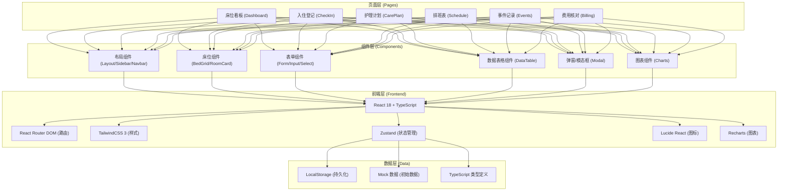
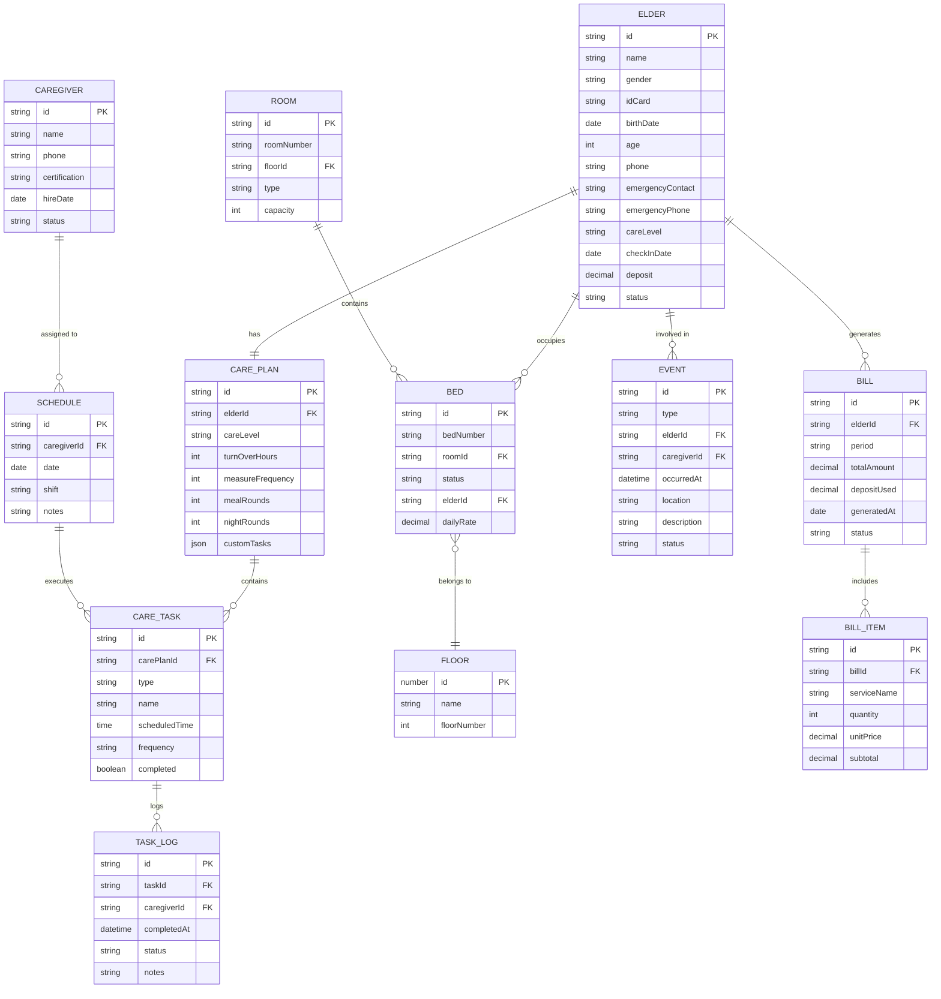

## 1. 架构设计



## 2. 技术描述

- **前端框架**：React@18 + TypeScript@5
- **构建工具**：Vite@5
- **路由管理**：react-router-dom@6
- **样式方案**：TailwindCSS@3 + PostCSS
- **状态管理**：Zustand@4（轻量级，支持持久化中间件）
- **UI 图标**：lucide-react@0.344
- **数据可视化**：recharts@2（柱状图、饼图、折线图）
- **数据持久化**：localStorage + Zustand persist 中间件
- **初始化工具**：vite-init
- **后端**：无后端（纯前端应用，使用 mock 数据）
- **数据库**：无数据库（数据存储在 localStorage）

## 3. 路由定义

| 路由路径 | 页面组件 | 用途说明 |
|----------|----------|----------|
| `/` | Dashboard | 床位看板首页（默认重定向） |
| `/dashboard` | Dashboard | 床位看板、状态总览、统计卡片 |
| `/checkin` | CheckIn | 入住登记、老人信息录入、押金管理 |
| `/checkin/:id` | CheckInDetail | 入住详情编辑、查看 |
| `/care-plan` | CarePlan | 护理计划配置、任务频次设置 |
| `/care-plan/:elderId` | CarePlanDetail | 单人护理计划详情 |
| `/schedule` | Schedule | 护理员排班表、周视图排班 |
| `/events` | Events | 事件记录、超时提醒面板 |
| `/billing` | Billing | 费用核对、服务明细、退住结算 |
| `/billing/settle/:elderId` | SettleDetail | 单人退住结算页面 |
| `/statistics` | Statistics | 月度工作量统计、床位调换历史 |

## 4. 数据模型

### 4.1 实体关系图 (ER Diagram)



### 4.2 核心 TypeScript 类型定义

```typescript
// 床位状态枚举
export type BedStatus = 'empty' | 'reserved' | 'occupied' | 'discharged';

// 护理等级枚举
export type CareLevel = 'self-care' | 'semi-care' | 'full-care' | 'special-care';

// 班次枚举
export type ShiftType = 'morning' | 'afternoon' | 'night';

// 事件类型枚举
export type EventType = 'fall' | 'outing' | 'leave' | 'visit';

// 楼层
export interface Floor {
  id: string;
  name: string;
  floorNumber: number;
}

// 房间
export interface Room {
  id: string;
  roomNumber: string;
  floorId: string;
  type: 'single' | 'double' | 'triple' | 'quad';
  capacity: number;
}

// 床位
export interface Bed {
  id: string;
  bedNumber: string;
  roomId: string;
  status: BedStatus;
  elderId?: string;
  dailyRate: number;
}

// 老人信息
export interface Elder {
  id: string;
  name: string;
  gender: 'male' | 'female';
  idCard: string;
  birthDate: string;
  age: number;
  phone: string;
  emergencyContact: string;
  emergencyPhone: string;
  careLevel: CareLevel;
  checkInDate: string;
  deposit: number;
  status: 'active' | 'discharged' | 'reserved';
  medicalHistory?: string;
  allergies?: string;
}

// 护理计划
export interface CarePlan {
  id: string;
  elderId: string;
  careLevel: CareLevel;
  turnOverHours: number;        // 翻身频次(小时)
  measureFrequency: 'daily' | 'bidaily' | 'weekly';  // 测量频次
  morningCare: boolean;         // 晨间护理
  eveningCare: boolean;         // 晚间护理
  mealAssist: boolean;          // 协助用餐
  bathingSchedule: 'daily' | 'every2days' | 'weekly'; // 洗澡频次
  mealRounds: number;           // 每日送餐次数
  nightRounds: number;          // 夜间巡房次数
  customTasks: CustomTask[];
}

// 自定义护理任务
export interface CustomTask {
  id: string;
  name: string;
  description: string;
  scheduledTime: string;
  frequency: 'daily' | 'specific';
}

// 护理任务实例
export interface CareTask {
  id: string;
  carePlanId: string;
  elderId: string;
  type: string;
  name: string;
  scheduledDate: string;
  scheduledTime: string;
  caregiverId?: string;
  status: 'pending' | 'in-progress' | 'completed' | 'overdue';
  completedAt?: string;
  notes?: string;
}

// 护理员
export interface Caregiver {
  id: string;
  name: string;
  gender: 'male' | 'female';
  phone: string;
  certification: string;
  hireDate: string;
  status: 'active' | 'leave' | 'inactive';
}

// 排班
export interface Schedule {
  id: string;
  caregiverId: string;
  date: string;
  shift: ShiftType;
  assignedBeds?: string[];
  notes?: string;
}

// 事件记录
export interface EventRecord {
  id: string;
  type: EventType;
  elderId: string;
  caregiverId?: string;
  occurredAt: string;
  location: string;
  description: string;
  handledBy?: string;
  status: 'pending' | 'processing' | 'resolved';
  attachments?: string[];
}

// 账单
export interface Bill {
  id: string;
  elderId: string;
  period: string;       // YYYY-MM
  items: BillItem[];
  totalAmount: number;
  depositUsed: number;
  payableAmount: number;
  generatedAt: string;
  status: 'pending' | 'paid' | 'settled';
}

// 账单明细
export interface BillItem {
  id: string;
  serviceName: string;
  category: 'room' | 'care' | 'meal' | 'medical' | 'other';
  quantity: number;
  unitPrice: number;
  subtotal: number;
  dateFrom?: string;
  dateTo?: string;
}

// 床位调换记录
export interface BedTransfer {
  id: string;
  elderId: string;
  fromBedId: string;
  toBedId: string;
  transferDate: string;
  reason: string;
  rateDifference: number;
  approvedBy: string;
}

// 月度工作量统计
export interface MonthlyWorkload {
  caregiverId: string;
  caregiverName: string;
  yearMonth: string;
  totalShifts: number;
  morningShifts: number;
  afternoonShifts: number;
  nightShifts: number;
  tasksCompleted: number;
  overtimeHours: number;
}
```

## 5. 项目目录结构

```
├── src/
│   ├── components/
│   │   ├── layout/
│   │   │   ├── AppLayout.tsx      # 主布局组件
│   │   │   ├── Sidebar.tsx        # 侧边导航栏
│   │   │   ├── Navbar.tsx         # 顶部导航栏
│   │   │   └── PageHeader.tsx     # 页面标题组件
│   │   ├── beds/
│   │   │   ├── BedGrid.tsx        # 床位网格
│   │   │   ├── RoomCard.tsx       # 房间卡片
│   │   │   ├── BedCard.tsx        # 床位卡片
│   │   │   └── BedDetailModal.tsx # 床位详情弹窗
│   │   ├── forms/
│   │   │   ├── ElderForm.tsx      # 老人信息表单
│   │   │   ├── CarePlanForm.tsx   # 护理计划表单
│   │   │   ├── EventForm.tsx      # 事件记录表单
│   │   │   └── BedSelect.tsx      # 床位选择器
│   │   ├── ui/
│   │   │   ├── Button.tsx         # 按钮组件
│   │   │   ├── Input.tsx          # 输入框
│   │   │   ├── Select.tsx         # 下拉选择
│   │   │   ├── Modal.tsx          # 弹窗
│   │   │   ├── Badge.tsx          # 状态标签
│   │   │   ├── Card.tsx           # 卡片容器
│   │   │   ├── Table.tsx          # 数据表格
│   │   │   ├── StatCard.tsx       # 统计卡片
│   │   │   └── Alert.tsx          # 提醒横幅
│   │   ├── schedule/
│   │   │   ├── ScheduleGrid.tsx   # 排班网格
│   │   │   └── ScheduleCell.tsx   # 排班单元格
│   │   └── billing/
│   │       ├── BillTable.tsx      # 账单表格
│   │       └── SettleModal.tsx    # 结算弹窗
│   ├── pages/
│   │   ├── Dashboard.tsx          # 床位看板
│   │   ├── CheckIn.tsx            # 入住登记
│   │   ├── CarePlan.tsx           # 护理计划
│   │   ├── Schedule.tsx           # 排班表
│   │   ├── Events.tsx             # 事件记录
│   │   ├── Billing.tsx            # 费用核对
│   │   └── Statistics.tsx         # 统计分析
│   ├── store/
│   │   ├── index.ts               # Zustand Store
│   │   ├── bedStore.ts            # 床位相关状态
│   │   ├── elderStore.ts          # 老人相关状态
│   │   ├── scheduleStore.ts       # 排班相关状态
│   │   ├── eventStore.ts          # 事件相关状态
│   │   └── billingStore.ts        # 费用相关状态
│   ├── data/
│   │   ├── mockData.ts            # Mock 初始数据
│   │   └── seed.ts                # 数据初始化函数
│   ├── types/
│   │   └── index.ts               # 所有类型定义
│   ├── utils/
│   │   ├── dateUtils.ts           # 日期工具函数
│   │   ├── calcUtils.ts           # 计算工具函数
│   │   └── formatUtils.ts         # 格式化工具
│   ├── hooks/
│   │   ├── useCareTasks.ts        # 护理任务生成 Hook
│   │   └── useReminder.ts         # 超时提醒 Hook
│   ├── App.tsx
│   ├── main.tsx
│   └── index.css
├── shared/
│   └── types.ts                   # 前后端共享类型(预留)
├── package.json
├── tsconfig.json
├── vite.config.ts
├── tailwind.config.js
└── postcss.config.js
```
